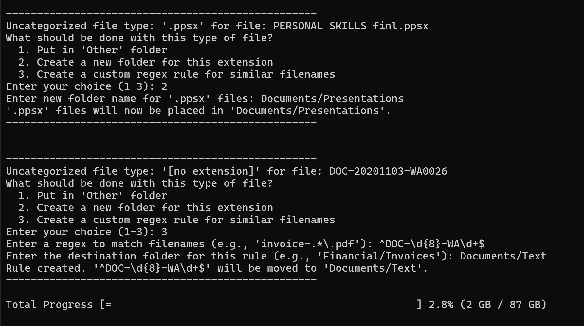
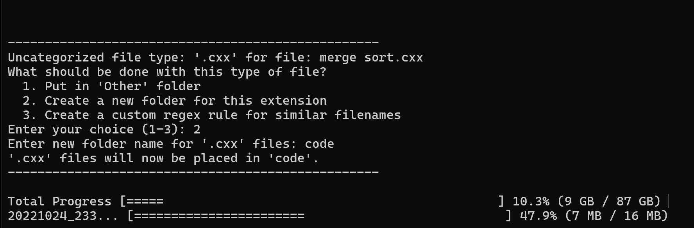

# Ekatra
**A command-line tool to merge and organize messy folders.**

Ekatra is a C++ tool that merges two folders into a single, clean directory, sorting files by type as it goes. I wrote it to solve the common headache of cleaning up scattered files.

## Features
- **Sorts files into default categories** (Media/Images, Documents/Text, Archives, etc.).
- **Supports custom sorting** with a regex rules file for more control.
- **Simple Merging**: A `--no-sort` flag to just combine folders without categorization, skipping any duplicates.
- **Ignores hidden files** (dotfiles like `.DS_Store`) by default to avoid clutter, with an option to include them.
- If it finds a file type it doesn't recognize, it **prompts you to create a new rule** for it—this can be a simple folder for that extension or a new regex for similar filenames.
- **Renames duplicate files** by default (`file_1.txt`) to prevent overwriting. You can also tell it to just skip them.
- **Scan Mode** Dry run mode that scans all uncategorized files and lists them in a text file, helping you define sorting rules before performing any move or copy operations.
- **Cross-platform C++17** that builds and runs on macOS, Linux, and Windows.

## Default Folder Structure
Here’s where your files will end up with the standard rules:

```
📁 Destination/
├── 📁 Media/
│   ├── 📁 Images/ (.jpg, .png, .gif, ...)
│   └── 📁 Videos/ (.mp4, .mov, .avi, ...)
├── 📁 Documents/
│   ├── 📁 Text/ (.pdf, .doc, .docx, .txt, ...)
│   ├── 📁 Spreadsheets/ (.xls, .xlsx, .csv, ...)
│   └── 📁 Presentations/ (.ppt, .pptx, .key, ...)
├── 📁 Audio/ (.mp3, .wav, .aac, ...)
├── 📁 Archives/ (.zip, .rar, .7z, ...)
├── 📁 Code/ (.cpp, .py, .js, ...)
└── 📁 Other/ (For anything that doesn't fit the rules)
```

## How to Use It
Run it from your terminal:
```bash
ekatra <source_A> <source_B> <destination> [options]
```

### Arguments & Options

| Argument      | Description                                  |
|---------------|----------------------------------------------|
| `source_A`    | **Required.** The first source folder.       |
| `source_B`    | **Required.** The second source folder.      |
| `destination` | **Required.** Where the organized files should go. |

| Option             | Shorthand | Description                                           | Default |
|--------------------|-----------|-------------------------------------------------------|---------|
| `--mode <mode>`      |           | Use `copy` (safe) or `move` (fast).                   | `copy`  |
| `--no-sort`          |           | Merges files without sorting; skips duplicates.       | `false` |
| `--skip-duplicates`  |           | Don't rename duplicates; just skip them.              | `false` |
| `--include-hidden`   |           | Includes hidden files (dotfiles) in the merge.        | `false` |
| `--rules <file>`     |           | Path to a custom text file for regex sorting rules.   |         |
| `--scan <file>`      |           | Perform a 'dry run' to find all uncategorized files and list them in the specified file.                          
| `--verbose`          | `-v`      | Shows every file being processed.                     | `false` |
| `--help`             |           | Shows the help message.                               |         |

### Examples
**Basic copy:**
```bash
./ekatra ~/Downloads/FolderA ~/Desktop/FolderB ~/Documents/Merged
```

**Move files, skip duplicates, and include hidden files:**
```bash
./ekatra /vol/Photos /vol/Backup ~/Pictures/Organized --mode move --skip-duplicates --include-hidden
```

**Sort using a custom rules file:**
```bash
./ekatra ~/AllMyDocs ~/WorkDocs ~/Sorted --rules ./my_rules.txt
```

### A Better Workflow: Using Scan Mode
For large or complex merges, you can use the scan mode for a safer, more controlled workflow:

1.  **Scan for Uncategorized Files:**
    Run Ekatra with the `--scan` flag to generate a list of all files that don't match your current rules. No files will be moved.
    ```bash
    ./ekatra ~/FolderA ~/FolderB ~/Destination --scan ./uncategorized.txt
    ```

2.  **Create Your Rules:**
    Open the generated `uncategorized.txt` file. Use this list to create a powerful `my_rules.txt` file (see "Advanced Sorting with Regex" below).

3.  **Run the Merge:**
    Now, run Ekatra again, this time providing your new rules file. It will process all files cleanly without needing to prompt you.
    ```bash
    ./ekatra ~/FolderA ~/FolderB ~/Destination --rules ./my_rules.txt
  

## Advanced Sorting with Regex
You can extend the default sorting logic with regular expressions in two ways:

### 1. Using a Rules File (`--rules`)
Provide a text file where each line is a rule in the format `regex:destination_folder`.

**Example `my_rules.txt`:**
```
# Comments are ignored
# Sort financial documents
^invoice-.*\.pdf$:Financial/Invoices
.*-receipt-\d{4}\.jpg$:Financial/Receipts

# Sort university work
^CS101-assignment-.*$:University/CS101
^MATH203-lecture-notes\.pdf$:University/MATH203
```

These rules are checked before the default sorting logic.

### 2. Interactive Rule Creation
When Ekatra finds a file it doesn't recognize, it prompts you with options. If you choose "Create a custom regex rule," it will guide you to create a new rule right in the terminal. This rule is then remembered for the rest of the session, letting you build up complex sorting logic without ever touching a config file.

**Example 1: Creating a Regex Rule**
Here, Ekatra finds a WhatsApp document that's missing its file extension. We can create a regex rule to catch all similar files.



**Example 2: Creating a Folder Rule**
Ekatra finds a `.cxx` C++ source file. We can tell it to put all files with this extension into the existing `Code` folder.



## Building from Source
You'll need:
- A C++17 compiler (Clang, GCC, MSVC)
- CMake (3.16 or newer)

**Steps:**
1. **Clone the repo:**
   ```bash
   git clone git@github.com:kushagra1212/ekatra.git
   cd ekatra
   ```

2.  **Configure with CMake:**
    ```bash
    cmake -S . -B build
    ```

3.  **Compile:**
    ```bash
    cmake --build build
    ```

4.  **Run:**
    The executable is in the `build` folder.
    ```bash
    ./build/ekatra --help
    ```

---
Copyright (c) 2025 Kushagra Rathore. Released under the GNU GPL v2.0 License.